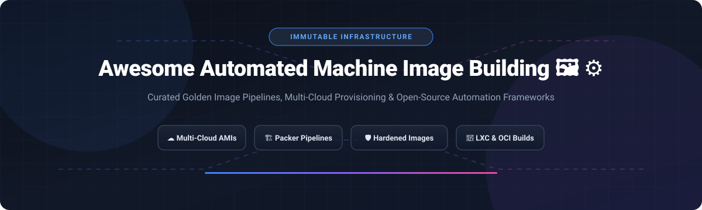

# Awesome-Automated-Machine-Image-Building 🖼️ ⚙️

  

  
  
  
  
  
  

---

## 🌟 Top Automated Machine Image Building Ecosystem ⚡

**Curated List of Commercial Image Builders, Cloud Native VM Image Pipelines & Open-Source Image Automation Frameworks** 🚀  
*Focused on Golden Image Pipelines, Immutable Infrastructure, Multi-Cloud Provisioning, DevSecOps Compliance & Self-Hosted Build Systems* 🛡️

**Last updated: October 2026** 📅

---

### 📌 Overview & SEO Summary 🔍
Welcome to the ultimate community-curated directory of **automated machine image building platforms**, **golden image pipelines**, and **open-source VM provisioning frameworks**. Modern DevOps, Cloud Engineering, and Platform Security teams leverage automated machine image building to achieve **immutable infrastructure**, enforce **CIS security compliance**, accelerate **VM autoscaling boot times**, and streamline **multi-cloud image distribution** across AWS EC2, Azure VMs, Google Cloud Platform (GCP), and on-premises hypervisors.

Whether you are looking for enterprise-grade managed commercial solutions (such as *Microsoft Azure VM Image Builder*, *AWS EC2 Image Builder*, *GitHub Actions*, or *Red Hat Image Builder*), or self-hostable open-source frameworks (like *systemd*, *HashiCorp Packer*, *Kaniko*, *runc*, *Buildah*, and *Cloud-init*), this list provides comprehensive architectural comparisons, exact pricing models, free tier limits, market metrics, and direct open-source repository links. 💡

---

## 📑 Table of Contents 📖
- [🏢 SaaS & Commercial Platforms](#-saas--commercial-platforms)
- [🔓 Open-Source GitHub Projects](#-open-source-github-projects)
- [🛠️ How to Contribute](#%EF%B8%8F-how-to-contribute)
- [📊 Star History](#-star-history)
- [🤝 Support & Sponsorship](#-support--sponsorship)
- [⚠️ Disclaimer](#%EF%B8%8F-disclaimer)

---

## 🏢 SaaS & Commercial Platforms 💼

> [!NOTE]
> **Market Size & Industry Concentration:** The global Cloud Infrastructure and Machine Image Automation market is estimated at **$7.2 Billion in 2026** (expanding within the broader $35B Infrastructure-as-Code & DevOps Automation market at a 22.4% CAGR). The sector is **highly concentrated (winner-take-most)**, dominated by hyperscale cloud service providers (Microsoft Azure, Amazon Web Services, Google Cloud Platform) and major platform vendors (Broadcom/VMware, Red Hat/IBM), while specialized artifact management vendors capture niche enterprise workloads.

The machine image building market is split between hyperscaler-native services (AWS, Azure, GCP) that integrate deeply with public cloud compute galleries, and enterprise OS vendors (Red Hat, Canonical, Oracle). Commercial platforms offer pre-configured pipelines, vulnerability scanning integration, and global artifact replication. 🌍

| SaaS / Commercial Platform | Company / Owner | Market Cap / Valuation 📈 | Standard Edition Starting Price 🏷️ | Free Tier / Free Trial Limits 🎁 | Description 📝 |
| :--- | :--- | :--- | :--- | :--- | :--- |
| **[Azure VM Image Builder](https://azure.microsoft.com/en-us/products/image-builder)** 🔷 | Microsoft | **~$3.90 Trillion** | **$0 platform fee** (Pay-as-you-go for build VM resources e.g. Standard_D2s_v3 at ~$0.096/hr) | **99.9% availability SLA**; pay only for underlying VM compute, storage, and networking during build | **Azure-native image building** — Managed service built on HashiCorp Packer engine. Integrates directly with Azure Compute Gallery (Shared Image Gallery). Automated Linux and Windows golden image pipelines. |
| **[GitHub Actions Image Builder](https://docs.github.com/en/actions)** 🐙 | Microsoft / GitHub | **~$3.90 Trillion** | **$0.008/minute** for standard Linux runners after free plan consumption | **Free 2,000 CI/CD minutes/month** for private repositories (Unlimited free for public repositories) | **CI/CD-driven image building** — Native GitHub runner pipelines authenticating via OIDC to Azure Compute Gallery or AWS AMI endpoints. Executes Packer, Docker, and QEMU workflows. |
| **[AWS EC2 Image Builder](https://aws.amazon.com/image-builder/)** ☁️ | Amazon | **~$2.00 Trillion** | **$0 platform fee** (Pay only for underlying EC2 build instances e.g. t3.micro at ~$0.104/hr, EBS storage, and SNS) | **Pay-as-you-go** for underlying resources; AWS Free Tier includes 750 hours/month of t2.micro/t3.micro compute | **AWS-native image automation** — Automated creation, testing, and distribution of Linux/Windows AMIs and container images. YAML build components, CVE scanning via Amazon Inspector, and EventBridge scheduling. |
| **[Google Cloud Image Family API](https://cloud.google.com/compute/docs/images)** 🌐 | Google (Alphabet) | **~$2.00 Trillion** | **$0 API fee** (Pay for GCE VM build instances e.g. e2-medium at ~$0.0335/hr and storage at $0.05/GB/month) | **$300 free credits** for 90 days for new GCP accounts; 1 e2-micro instance free forever in select US regions | **GCP image family management** — Declarative image lifecycle API. Manages image families to automatically point compute templates to the latest hardened OS image version. |
| **[Oracle Linux Image Builder](https://docs.oracle.com/en/operating-systems/oracle-linux/)** 🔴 | Oracle | **~$300.00 Billion** | **$0 for Oracle Linux ISO generation**; OCI compute pricing applies for cloud builds | **Oracle Cloud Always Free Tier** (2 AMD VMs and up to 4 Arm Ampere A1 cores free forever with 200GB block volume) | **Oracle Linux image creation** — Command-line and cloud blueprint service creating customized bootable ISOs, QCOW2, and Oracle Cloud Infrastructure (OCI) custom images. |
| **[VMware Image Builder](https://docs.vmware.com/en/VMware-vSphere/)** 🏢 | Broadcom (VMware) | **~$60.00 Billion** | **$4,685 per CPU core** (vSphere Foundation subscription pricing) | **30-day free trial** of vSphere Enterprise Plus with full PowerCLI Image Builder features | **ESXi hypervisor image customization** — Built-in vSphere tool for creating customized ESXi installation media, depot bundles, and hypervisor images with custom VIB drivers. |
| **[GitLab CI/CD Image Pipeline](https://docs.gitlab.com/ee/ci/)** 🦊 | GitLab | **~$8.00 Billion** | **$29.00/user/month** (GitLab Premium plan) | **Free 400 CI/CD minutes/month** on GitLab-hosted runners | **GitOps machine image pipeline** — Built-in runner framework executing containerized Packer, BitBake, and Docker build pipelines with dependency caching and artifact storage. |
| **[Red Hat Image Builder](https://console.redhat.com/insights/image-builder)** 🎩 | Red Hat (IBM) | **~$5.00 Billion** | **$1,796/year** (Standard RHEL Server 2-socket/2-VM subscription) | **No-cost Red Hat Developer Subscription for Individuals** (Build up to 16 RHEL systems free) | **Enterprise RHEL image builder** — Managed Red Hat Insights tool. Generates customized RHEL images for AWS, Azure, GCP, VMware ESXi, and bare-metal ISO deployments. |
| **[Canonical Ubuntu Pro Image Builder](https://ubuntu.com/pro)** 🟠 | Canonical | **Private (~$3.00 Billion)** | **$500.00/server/year** (or ~3.5% of underlying cloud compute cost on AWS/Azure/GCP) | **Free for up to 5 machines** for personal and non-commercial use | **Hardened Linux image pipeline** — Pre-configured Ubuntu Pro golden images featuring FIPS 140-2 compliance, CIS benchmarks, kernel livepatching, and 10-year extended security maintenance. |
| **[Cloudsmith](https://cloudsmith.com/)** 📦 | Cloudsmith | **Private (~$200.00 Million)** | **$45.00/user/month** (Cloudsmith Team plan) | **14-day free trial** with full enterprise pipeline features (Free tier available for verified open-source projects) | **Cloud-native artifact & image registry** — Continuous image distribution, secure package hosting, real-time vulnerability scanning, and SBOM generation supporting 30+ package formats. |

---

## 🔓 Open-Source GitHub Projects 🌟

*Sorted by GitHub Star Count (Descending)* 📊

- **[systemd/systemd](https://github.com/systemd/systemd)**   
  **The core system and service manager for Linux**, GPL-2.0 licensed. ⭐ **16,783 stars**. Includes `systemd-firstboot`, `systemd-repart`, and `systemd-nspawn` for provisioning immutable OS image trees and container images from declarative blueprints. ⚙️

- **[hashicorp/packer](https://github.com/hashicorp/packer)**   
  **The industry standard for multi-cloud machine image automation**, BSL-1.1 licensed. ⭐ **15,807 stars**. Creates identical VM images for AWS EC2, Azure, GCP, VMware, and VirtualBox from a single HCL2 template. Integrates with Ansible, Chef, and Shell provisioners. 🏗️

- **[GoogleContainerTools/kaniko](https://github.com/GoogleContainerTools/kaniko)**   
  **Daemonless container image builder for Kubernetes**, Apache-2.0 licensed. ⭐ **15,761 stars**. Builds container images inside a container or Kubernetes cluster without requiring privileged Docker daemon access. 🚀

- **[opencontainers/runc](https://github.com/opencontainers/runc)**   
  **OCI standard container runtime**, Apache-2.0 licensed. ⭐ **13,473 stars**. Low-level CLI tool for spawning and running OCI-compliant system container images according to the Open Container Initiative specification. 📦

- **[containers/buildah](https://github.com/containers/buildah)**   
  **Rootless OCI container image builder**, Apache-2.0 licensed. ⭐ **9,053 stars**. Facilitates building OCI and Docker images without running a daemon. Provides granular bash script control over image layers and mount points. 🛠️

- **[canonical/cloud-init](https://github.com/canonical/cloud-init)**   
  **Industry standard multi-vendor cloud instance initialization**, GPL-3.0 licensed. ⭐ **3,827 stars**. The multi-distribution package that handles early initialization of cloud VM images across AWS, Azure, GCP, OpenStack, and LXC. ☁️

- **[lxc/distrobuilder](https://github.com/lxc/distrobuilder)**   
  **System container and VM image builder for LXC and Incus**, Apache-2.0 licensed. ⭐ **878 stars**. Generates container and VM images from YAML definitions for Debian, Ubuntu, Arch Linux, Fedora, and CentOS. 🐧

- **[ansible/ansible-builder](https://github.com/ansible/ansible-builder)**   
  **Execution environment image builder for Ansible**, Apache-2.0 licensed. ⭐ **352 stars**. Generates Podman/Docker execution environment container images containing defined Ansible collections, Python dependencies, and system RPMs/DEBs. 🤖

- **[osbuild/osbuild](https://github.com/osbuild/osbuild)**   
  **Build pipelines for operating system artifacts**, Apache-2.0 licensed. ⭐ **280 stars**. The declarative build engine underlying Red Hat Image Builder. Converts JSON pipeline definitions into raw disk images, QCOW2, AMIs, and installer ISOs. 🔧

- **[Vanilla-OS/Vib](https://github.com/Vanilla-OS/Vib)**   
  **Flatpak-like recipe container image builder**, GPL-3.0 licensed. ⭐ **85 stars**. Generates Containerfiles using modular YAML recipes for custom OS distributions, immutable systems, and containerized dev environments. 🍦

- **[radiofrance/dib](https://github.com/radiofrance/dib)**   
  **Opinionated DAG image builder**, CeCILL V2.1 licensed. ⭐ **21 stars**. Builds multi-stage Docker images based on directed acyclic graph (DAG) dependency resolution with incremental build caching. 📊

- **[safesoftware/fme-server-iac-templates](https://github.com/safesoftware/fme-server-iac-templates)**   
  **Automated Jenkins & Packer AMI pipeline templates**, MIT licensed. ⭐ **5 stars**. Production-grade IaC repository demonstrating automated AMI building pipelines with Jenkins, Packer, and AWS Terraform integration. 🌐

- **[kiransurya-devops/golden-image-pipeline](https://github.com/kiransurya-devops/golden-image-pipeline)**   
  **DevSecOps Golden AMI Build Pipeline**, Apache-2.0 licensed. ⭐ **0 stars**. Automated Jenkins HA + Packer + Ansible + Terraform golden image pipeline with CIS benchmark hardening, Trivy scanning, and SSM Session Manager enforcement. 🛡️

---

## 🛠️ How to Contribute 🤝

Contributions are warmly welcome! Follow these steps to submit new image building platforms, cloud tools, or open-source automation frameworks:

1. 🍴 **Fork** the repository.
2. 📝 **Add/edit** entries in `README.md` maintaining table/list structure, emojis, and exact formatting.
3. 🔗 Include project title, official website/GitHub link, exact star badges linking to `/stargazers`, license, and concise description.
4. 🚀 Submit a **Pull Request** with a descriptive summary of your changes.

---

## 📊 Star History 📈

---

## 🤝 Support & Sponsorship 💖

If you find this automated machine image building repository useful, please consider supporting the project:

- ⭐ **Star** this repository to increase community visibility!
- 🔀 **Fork** and share with fellow DevOps engineers, SREs, and platform architecture teams.
- ☕ **Sponsor & Support**: Support ongoing open-source curation via the [GitHub Sponsor Dashboard](https://github.com/ishandutta2007).

---

## ⚠️ Disclaimer ℹ️

- This is a **community-curated** directory — not exhaustive and not an official endorsement. ℹ️
- Automated machine image building pipelines can incur cloud resource charges if build VMs are left running. Managed services like AWS EC2 Image Builder and Azure VM Image Builder have no platform fee, but underlying EC2/Azure VM compute, EBS/managed disk storage, and network egress charges accumulate during build cycles. **Monitor build pipelines and automate teardown of transient resources**. 🔒
- Open-source tools (systemd, HashiCorp Packer, Kaniko, Distrobuilder, Ansible Builder) offer complete self-hosted control and multi-cloud flexibility, while commercial offerings provide enterprise SLAs, managed SaaS controllers, and dedicated compliance support. 🖼️

---

  <b>Made with ❤️ for DevOps engineers, SREs, platform teams, and open-source infrastructure advocates.</b>

